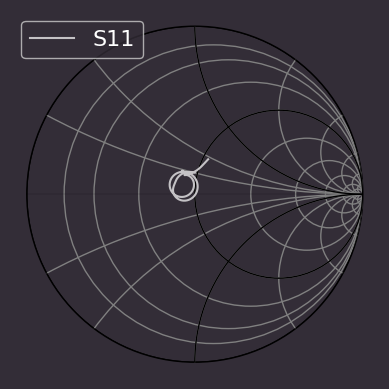
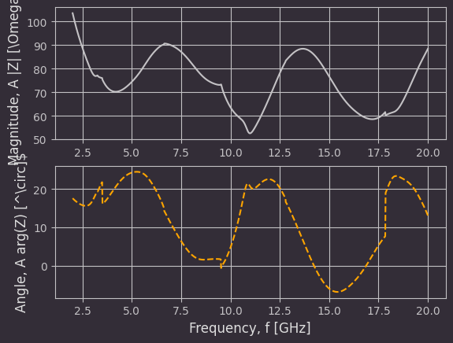
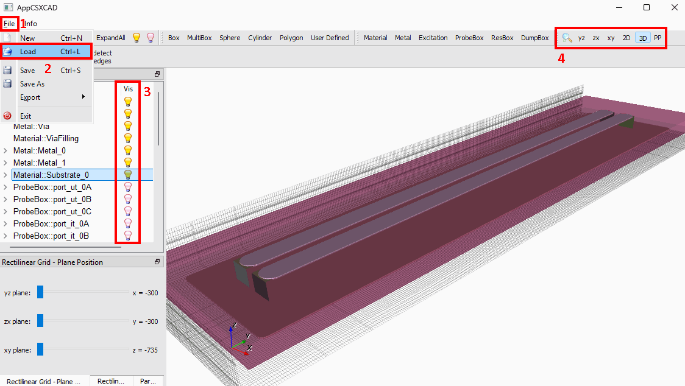

# gerber2ems - openEMS simulation based on Gerber files

Copyright (c) 2023 [Antmicro](https://www.antmicro.com)

Modified (c) 2025 [williamyang98](https://github.com/williamyang98)

This project aims to streamline signal integrity simulations using open source tools.
It takes PCB production files as input (Gerber, drill files, stackup information) and simulates trace SI performance using openEMS - a free and open electromagnetic field solver that uses the FDTD method.

This has been forked from [antmicro/gerber2ems](https://github.com/antmicro/gerber2ems) to add:
- Comprehensive documentation.
- Configuration of nanomesh.
- Fixes to nanomesh which resulted in missing or merged copper traces.
- Control over input and output directories.
- Correction of xy offset in simulation port and vias via configuration file.
- Embedding of copper layers into dielectric for better modelling of edge side coupling in differential pairs.

## Documentation
Documentation can be found [here](https://williamyang98.github.io/gerber2ems/docs/).

1. [Installation](https://williamyang98.github.io/gerber2ems/docs/installation)
2. [Exporting files](https://williamyang98.github.io/gerber2ems/docs/export_pcb)
3. [Configuration](https://williamyang98.github.io/gerber2ems/docs/configuration)
4. [Running simulation](https://williamyang98.github.io/gerber2ems/docs/running)
5. [Visualise results](https://williamyang98.github.io/gerber2ems/docs/visualise_results)
6. [Visualise geometry](https://williamyang98.github.io/gerber2ems/docs/visualise_geometry) 
7. [Visualise fields](https://williamyang98.github.io/gerber2ems/docs/visualise_fields) 

## Gallery
### Smith chart

### Differential impedance

### Visualising geometry

### Visualising E-fields with Paraview
https://github.com/user-attachments/assets/467630fa-eb7f-4268-b3ea-a0b4997c61ea

*Simulation of differential pair*

https://github.com/user-attachments/assets/b16ab520-ca9b-4d1a-9d2a-7e88ee9ce144

*Simulation of differential pair over hatched ground plane*

## Useful links
- Original project: [antmicro/gerber2ems](https://github.com/antmicro/gerber2ems)
- Youtube tutorial for openEMS and KiCAD: [youtube/panire](https://www.youtube.com/watch?v=VcJqhsbzR3c)
